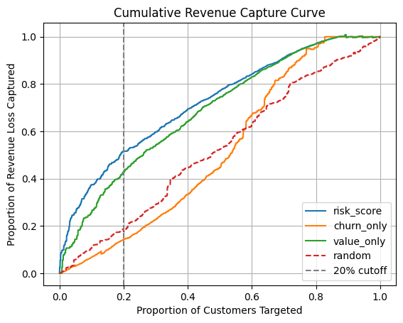

# Strategic Case Study: Customer Retention & Revenue Protection 

## Executive Summary

Senior executives frequently face a major frustration with enterprise data science: Great insights, but how does this help my team close more sales or save more revenue today? To solve this execution gap, I built a decision engine that transforms complex customer data into immediate, prioritized retention actions. By combining advanced customer valuation, churn risk modeling, and localized AI, the system identifies, quantifies, and ranks exactly which accounts customer-facing teams must contact first to maximize revenue protection.


## The Business Execution Gap

Most companies suffer from fragmented customer data insights and struggle to turn data analytics into bottom-line financial results:

- **The "Dashboard Blindness" Gap:** Teams look at churn charts but do not know which specific customer to call today.

- **Misaligned Priorities:** Marketing budgets are wasted chasing high-churn, low-value customers while quietly losing high-value accounts.

## The Solution: Predictive Engine & Architecture

To solve this, I built a three-layered data and AI architecture focused entirely on maximizing retention efficiency:

```plaintext

[Raw Transaction Data]
          │
          ▼
┌────────────────────────────────────────┐
│      Predictive Analytics Layer        │
│  - CLV Model (Future Value)            │
│  - Churn Model (Risk Probability)      │
│  - K-Means (Behavioral Segmentation)   │
└────────────────────────────────────────┘
          │
          ▼
┌────────────────────────────────────────┐
│         Data & Storage Layer           │
│  - PostgreSQL Database                 │
│  - Unified "Revenue-at-Risk" Metric    │
└────────────────────────────────────────┘
          │
          ▼
┌────────────────────────────────────────┐
│      Intelligent Action Layer          │
│  - Local Llama LLM via SQL Functions   │
│  - Streamlit UI for Sales/CS Teams     │
└────────────────────────────────────────┘
```

**The Scoring Engine:** 

The system calculates a unified "Revenue-at-Risk" metric by intersecting customer value (CLV), churn probability, and behavioral clusters via K-Means segmentation.

**The Storage Layer:** M

odel scores and customer behavioral features are stored and continually updated within a PostgreSQL database.

**The AI Execution & Streamlit Layer:** 

To make the data instantly actionable for non-technical teams, a local Llama LLM queries the database via custom SQL functions. This is served through a simple, intuitive Streamlit user interface. Sales and account management teams can use natural language to instantly pull high-priority task lists (e.g., *"Show me our highest-value clients who are at immediate risk of leaving"*).

---

## Strategic Business Impact 

Evaluating this system against traditional methods on historical data yielded massive performance improvements:

- **21% Efficiency Lift:** The combined Revenue-at-Risk framework achieved a **+9 percentage point lift** over targeting by customer value alone, and vastly outperformed a churn-only approach.

- **Resource Optimization:** By targeting just the top 20% of accounts flagged by this system, account management teams can **capture ~52% of all potential revenue loss** over the following three months.

- **Operational ROI:** Sales and Customer Success teams save more contract value with less manual labor, entirely optimizing the business's retention budget.



---

## Live Demo

Watch the system below:

[▶️ Demo Video](https://www.loom.com/share/b88a7162a7d149e6946e60b30c0bf962)

---

## Limitations

- Results depend on data quality and available signals
- In this dataset, customer value was a stronger driver and churn adds incremental improvement. In other settings with stronger churn signals, the uplift could be larger.
- Performance is expected to improve with richer behavioral data
- CLV is approximated using predicted purchase frequency and historical AOV, which introduces bias in absolute values. However, since the business objective is prioritization rather than exact forecasting, I evaluated the system based on its ability to rank customers by revenue-at-risk. Other CLV methods can yield different results